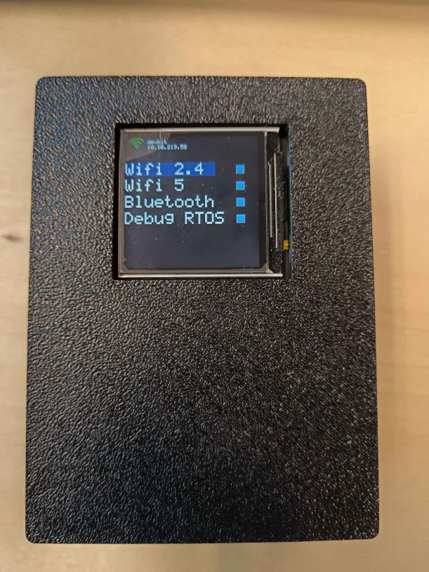

## MENU
De netwerkscanner beeld een klein menu voor. Er op kan je schakelen met welke soorten netwerken je wilt scannen. 
De verschillende soorten netwerken zijn:
    -Wifi 2.4
    -Wifi 5
    -Bluetooth
    -Debug RTOS (extra informatie voor developer)

Links boven wordt er ook afgebeeld met welk netwerk het device verbonden is met naam en IP adress

## FUNCTIE
Het device kan je besturen met de 6 knoppen op de zijkant met elk een aparte functie.

(Van boven naar beneden)
- Knop 1 = UP: Navigeert naar boven op het menu.
- Knop 2 = DOWN: Navigeert naar benenden op het menu.
- knop 3 = SELECT: Selecteert het netwerk dat je wil scannen.
- knop 4 = BACK
- Knop 5 = RESET: Hard reset het volledige device.
- Knop 6 = Vrij

## HARDWARE

## CODE
Doordat de ESP maar 1 processor heeft kan hij technisch gezien maar 1 ding tergelijk doen. Aan de hand van FreeRTOS, een klein bestuursysteem, wat heel snel kan wisselen tussen taken zodat het lijkt dat het met meerdere tergerlijktijd bezig is. xTaskCreate() wordt gebruikt om de taak te creëren.

xTaskCreate(
    ScannerTask,    // welke functie
    "ScannerTask",  // naam voor debugging
    4096,           // geheugen (stack) in bytes
    NULL,           // extra parameters
    5,              // prioriteit
    NULL            // handle (optioneel)
);

 Wanneer verschillende taken data willen gebruiken maken we gebruik van queues. In queues wordt data in een rij geplaats waarin de eerste die binnen kwam, ook het eerste eruit gaat. Dit zorgt ervoor zodat er nooit tergelijk data gebruikt wordt. xQueueCreate() wordt gebruikt om de queue te maken, xQueueSend() om het te verzenden en xQueueReceive om het te lezen.

Taken:

- MenuTask: Start het display op en wacht op berichten in de -menuqueue-. Die berichten komen via knopinterrupts of van de WiFi-verbindingstaak. Berichten zijn de verschillende knoppen (zoals UP, DOWN, SELECT, ...) maar ook de EVENT_WIFI_CONNECTED en portMAX_DELAY

- ScannerTask: Blijft kijken naar GlobalScanConfig (Houdt bij wat gescanned mag worden) om te weten wat gescanned moet worden.
GlobalScanConfig stelt de frequentie banden dat in wifi_scan_config_t wordt opgesteld. Met
esp_wifi_scan_start() wordt de wifi gescanned maar stopt ook de code tot dat de volledige scan klaar is. Via
esp_wifi_scan_get_ap_records() worden de wifi resultaten gehaald en in de Queue gezt door JsonBuilderTask.
Voor bluetooth wordt StartBleScan(5000) gebruikt wat een scan start voor 5 seconden. Via ble_gap_event_handler worden de gevonden apparaten een voor een in de BluetoothQueue geplaatst.

    (Frequentiebanden): wifi2_4Ghz alleen  → channel bitmap 0x3ffe
                        wifi5Ghz alleen    → channel bitmap 0xfeffffe  
                        Beide              → beide bitmaps actief

- JsonBuilderTask: Verwerkt de scandata en verstuurt het naar de server. De taak gebruikt Queueset wat het mogelijk maakt om op meerdere queues tergerlijkertijd te wachten. Zodra dat de wifiqueue en bluetoothqueue komen activeerd de Queueset. De wifi data wordt verdeeld in 10 netwerken per HTTP POST erna wordt het geheugen weer vrijgesteld.

knoppensysteem:
Wanneer de knoppen ingedrukt worden verandert de spanning wat een interrupt veroorzaakt. Maar wanneer een knop ingedrukt stuitert het knoppen een paar keer wat meerdere inputs veroorzaakt wat niet de bedoeling is. Daardoor maken we gebruik van Debouncing.

if (now - lastIsrTimeUp < 50000) {  // 50ms in microseconden
    return;  // negeer dit signaal
}
Met Debouncing wordt de 50ms seconden na de eerste input genegeert zodat het als 1 input blijft.
