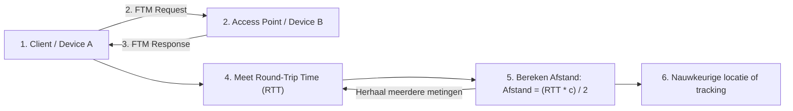

# Fine Timing Measurement (FTM) in WiFi

FTM is een techniek gebruikt in WiFi om **heel nauwkeurig de afstand** tussen twee apparaten te meten. Het is vooral handig voor **indoor positioning** en **precisie-locatiebepaling**.

---

## 1. Basisprincipe

FTM werkt via **Round-Trip Time (RTT)**:

1. Device A stuurt een FTM-request naar Device B.
2. Device B stuurt een FTM-response terug.
3. Device A meet de tijd tussen het versturen van de request en het ontvangen van de response.

De afstand wordt berekend met de formule:

\[
\text{Afstand} = \frac{\text{RTT} \times c}{2}
\]

Waarbij:

- \( \text{RTT} \) = Round-Trip Time (tijd in seconden)
- \( c \) = snelheid van het licht (~\(3 \times 10^8\) m/s)
- Deling door 2 omdat het signaal heen en terug gaat

---

## 2. Vereisten voor FTM

- Beide apparaten moeten **802.11mc (WiFi RTT)** ondersteunen.
- Het netwerk kan op **2.4 GHz** of **5 GHz** werken, maar 5 GHz geeft betere nauwkeurigheid.
- FTM kan gebruikt worden met **APs (Access Points)** en **clients** die FTM ondersteunen.

---

## 3. Processtappen

1. **Initiatie:** Client stuurt FTM Request naar AP.
2. **Antwoord:** AP stuurt FTM Response.
3. **Tijdmeting:** Client meet exacte tijd van heen en terug.
4. **Berekening:** Client gebruikt RTT voor afstandsberekening.
5. **Eventueel averaging:** Meerdere RTT metingen om fouten te verminderen.

---

## 4. Nauwkeurigheid

- Typisch: **~1 tot 2 meter** foutmarge
- Door **meerdere metingen** te nemen kan nauwkeurigheid verbeterd worden.
- Obstakels en reflecties (multipath) kunnen de meting beïnvloeden.

---

## 5. Toepassingen

- Indoor navigatie (zoals in winkels of magazijnen)
- Robotica en drones
- Asset tracking
- Smart home toepassingen

---

## 6. Voordelen

- Hoge precisie in vergelijking met RSSI-only methoden.
- Werkt met bestaande WiFi-netwerken.
- Kan real-time locatie-updates geven.

---

## 7. Beperkingen

- Vereist 802.11mc compatibele hardware.
- Nauwkeurigheid wordt beïnvloed door muren, objecten en reflecties.
- Niet altijd beschikbaar op oudere apparaten.

---

## 8. Voorbeeldformule

Stel RTT = 20 nanoseconden (ns):

\[
\text{Afstand} = \frac{20 \times 10^{-9} \times 3 \times 10^8}{2} = 3 \text{ meter}
\]

---

FTM maakt het dus mogelijk om **exact te meten hoe ver apparaten van elkaar verwijderd zijn**, veel nauwkeuriger dan enkel met signaalsterkte (RSSI).



code snippet:

```c++
#include "esp_wifi.h"
#include "esp_event.h"
#include "esp_log.h"
#include "nvs_flash.h"

static const char* TAG = "FTM";

// SSID van het AP dat FTM ondersteunt
#define TARGET_SSID "YourFTMAP"

// Callback functie voor RTT events
static void wifi_rtt_event_handler(void* arg, esp_event_base_t event_base,
                                   int32_t event_id, void* event_data) {
    if (event_id == WIFI_EVENT_RTT_REPORT) {
        // RTT-rapport ontvangen
        wifi_rtt_report_t* report = (wifi_rtt_report_t*)event_data;
        if (report->status == WIFI_RTT_STATUS_SUCCESS) {
            // RTT in seconden (van nanoseconden)
            float rtt_sec = report->rtt / 1e9;
            // Afstand berekenen: afstand = (RTT * snelheid van licht) / 2
            float afstand = (rtt_sec * 3e8) / 2;
            ESP_LOGI(TAG, "RTT: %f ns, Afstand: %.2f m", report->rtt, afstand);
        } else {
            // Als FTM meting mislukt
            ESP_LOGW(TAG, "FTM mislukte meting, status=%d", report->status);
        }
    }
}

void app_main() {
    // 1️⃣ NVS initialisatie nodig voor WiFi opslag
    nvs_flash_init();

    // 2️⃣ TCP/IP stack initialiseren
    tcpip_adapter_init();

    // 3️⃣ Event loop aanmaken zodat WiFi events kunnen worden afgehandeld
    ESP_ERROR_CHECK(esp_event_loop_create_default());

    // 4️⃣ WiFi initialisatie
    wifi_init_config_t cfg = WIFI_INIT_CONFIG_DEFAULT();
    ESP_ERROR_CHECK(esp_wifi_init(&cfg));

    // 5️⃣ ESP32 als Station (client) instellen
    ESP_ERROR_CHECK(esp_wifi_set_mode(WIFI_MODE_STA));

    // 6️⃣ WiFi starten
    ESP_ERROR_CHECK(esp_wifi_start());

    // 7️⃣ Callback registreren voor RTT events
    ESP_ERROR_CHECK(esp_event_handler_register(
        WIFI_EVENT, WIFI_EVENT_RTT_REPORT, &wifi_rtt_event_handler, NULL));

    // 8️⃣ RTT configuratie
    wifi_rtt_config_t rtt_cfg = {0};
    strcpy((char*)rtt_cfg.ssid, TARGET_SSID);  // doel-AP
    rtt_cfg.rtt_num_measurements = 8;          // aantal RTT metingen
    rtt_cfg.rtt_interval_ms = 100;             // interval tussen metingen

    // 9️⃣ Start RTT meting
    ESP_ERROR_CHECK(esp_wifi_start_rtt(&rtt_cfg));

    ESP_LOGI(TAG, "FTM meting gestart naar %s", TARGET_SSID);
}
```
