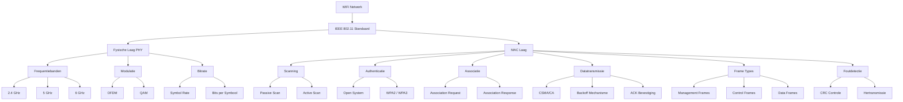
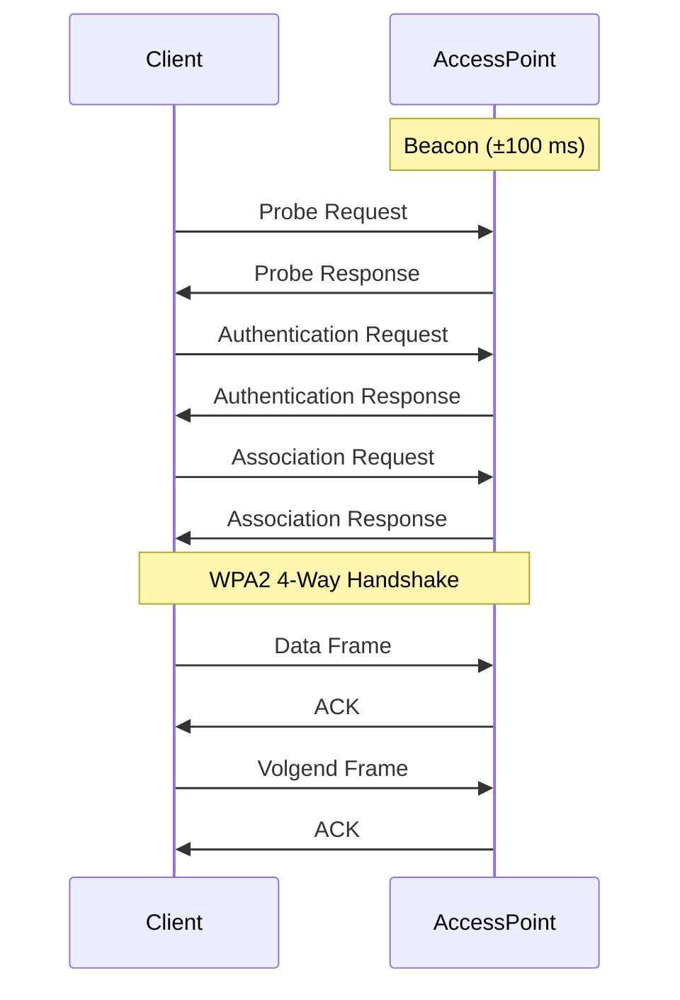

# 1. Inleiding

## 1.1 Doelstelling

Het doel van dit onderzoek is het analyseren van WiFi volgens de IEEE 802.11-standaard.  
De focus ligt op de werking op fysisch niveau (Layer 1) en MAC-niveau (Layer 2), inclusief netwerkdetectie, authenticatie, datatransmissie en foutcontrole.

## 1.2 Onderzoeksvragen

- Hoe werkt WiFi volgens IEEE 802.11?
- Hoe verloopt netwerkdetectie?
- Hoe gebeurt authenticatie en associatie?
- Hoe wordt mediumtoegang geregeld?
- Hoe wordt betrouwbaarheid verzekerd?

---

# 2. Theoretisch Kader

## 2.1 IEEE 802.11

WiFi is gebaseerd op de IEEE 802.11-standaard en opereert op:

- OSI Layer 1: Physical Layer (PHY)
- OSI Layer 2: Medium Access Control (MAC)

Kenmerken:
- Half-duplex communicatie
- Gedeeld transmissiemedium
- Collision Avoidance mechanisme

---

# 3. Fysische Laag (PHY)

## 3.1 Frequentiebanden

WiFi werkt in meerdere frequentiebanden:

- 2.4 GHz
- 5 GHz
- 6 GHz (WiFi 6E)

De golflengte wordt bepaald door:

λ = c / f  

waar:
- λ = golflengte (m)
- c = lichtsnelheid (3 × 10^8 m/s)
- f = frequentie (Hz)

---

## 3.2 Modulatie en Datatransmissie

WiFi gebruikt OFDM (Orthogonal Frequency Division Multiplexing).

Bits worden gemoduleerd via QAM (Quadrature Amplitude Modulation).

Bitrate:

Rb = Rs × b  

waar:
- Rb = bitrate (bit/s)
- Rs = symbol rate (symbolen/s)
- b = bits per symbool

Voorbeeld:
64-QAM → b = 6 bits per symbool

---

# 4. Netwerkdetectie

## 4.1 Passive Scanning

Access points versturen periodiek beacon frames.

Inhoud beacon:
- SSID
- BSSID
- Kanaal
- Ondersteunde datarates
- Beveiligingstype

---

## 4.2 Active Scanning

Client verstuurt een probe request.  
Access point antwoordt met probe response.

Verschil:
- Passive scanning = luisteren
- Active scanning = actief opvragen

---

# 5. Authenticatie en Associatie

## 5.1 Authenticatie

Client → Authentication Request  
Access Point → Authentication Response  

Bij beveiligde netwerken volgt daarna een key exchange.

---

## 5.2 Associatie

Client → Association Request  
Access Point → Association Response  

De client ontvangt een Association ID (AID).

---

# 6. Beveiliging

Moderne WiFi-netwerken gebruiken:

- WPA2
- WPA3

Tijdens de 4-way handshake wordt een sessiesleutel gegenereerd.

Conceptueel:

PTK = f(PMK, Nonce, MAC)

waar:
- PMK = Pairwise Master Key
- PTK = Pairwise Transient Key
- Nonce = willekeurig getal
- MAC = MAC-adressen van beide partijen

Het wachtwoord zelf wordt niet verzonden.

---

# 7. Mediumtoegang – CSMA/CA

WiFi gebruikt Carrier Sense Multiple Access with Collision Avoidance.

Proces:

1. Controleer of kanaal vrij is.
2. Wacht DIFS (Distributed Interframe Space).
3. Kies random backoff.
4. Verstuur frame.
5. Wacht op ACK.

Backoff-berekening:

Backoff = Random(0,CW) × SlotTime  

waar:
- CW = Contention Window
- SlotTime = vaste tijdseenheid afhankelijk van standaard

---

# 8. Frame Structuur

WiFi onderscheidt drie frametypes:

## 8.1 Management Frames
Voorbeeld:
- Beacon
- Probe
- Authentication
- Association

## 8.2 Control Frames
Voorbeeld:
- ACK
- RTS
- CTS

## 8.3 Data Frames

Een data frame bevat:

- Frame Control
- Duration
- MAC-adressen
- Sequence Number
- Payload
- FCS (Frame Check Sequence)

---

# 9. Foutdetectie en Betrouwbaarheid

WiFi gebruikt CRC (Cyclic Redundancy Check).

Indien CRC fout is:
- Geen ACK
- Hertransmissie

Betrouwbaarheid wordt dus op Layer 2 verzekerd.

---

# 10. Kanaalgebruik en Interferentie

## 10.1 Kanaalindeling

In de 2.4 GHz-band overlappen kanalen elkaar.  
Niet-overlappende kanalen zijn meestal:

- 1
- 6
- 11

## 10.2 Invloeden op Performantie

- Interferentie
- Multipath reflectie
- Obstakels
- Druk bezette kanalen

Impact:
- Lagere throughput
- Hogere latency
- Meer hertransmissies

---

# 11. Conclusie

WiFi volgens IEEE 802.11 is een geïntegreerd communicatiesysteem dat:

- Radiotransmissie gebruikt via OFDM
- Mediumtoegang regelt via CSMA/CA
- Authenticatie en encryptie toepast
- Fouten detecteert met CRC
- Betrouwbaarheid garandeert via ACK-mechanismen

Het combineert fysica, protocollen en cryptografie in één coherent netwerkmodel.