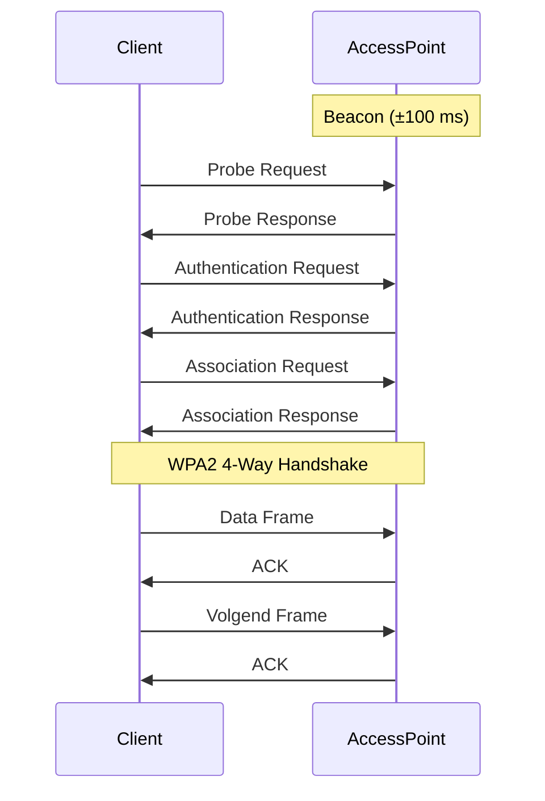

# WiFi Research

## WiFi Modes

| Mode           | Beschrijving                           |
| -------------- | -------------------------------------- |
| `Station`      | Verbindt met een bestaand WiFi netwerk |
| `Access Point` | Maakt een eigen WiFi netwerk aan       |
| `Station + AP` | Kan beide tegelijk                     |

## Veelgebruikte WiFi Commando's (ESP)

```cpp
WiFi.begin(ssid, password);        // Verbindt met netwerk
WiFi.softAP(ssid, password);       // Start access point
WiFi.status();                     // Controleert status
WiFi.disconnect();                 // Verbreekt verbinding
```

## WiFi Security Types

| Type      | Omschrijving          |
| :-------: | :-------------------: |
| `WEP`     | Verouderd, onveilig   |
| `WPA`     | Verbeterd, matig      |
| `WPA2`    | Modern, veilig        |
| `WPA3`    | Nieuwste, zeer veilig |

## Veelvoorkomende Problemen

| Probleem                | Mogelijke Oplossing             |
| :---------------------: | :-----------------------------: |
| Kan niet verbinden      | Controleer SSID en wachtwoord   |
| Slechte signaalsterkte  | Verplaats dichter bij router/AP |
| IP-adres niet verkregen | Controleer DHCP instellingen    |

## WiFi Scan Voorbeeld (ESP)

```cpp
int n = WiFi.scanNetworks();
for (int i = 0; i < n; ++i) {
  Serial.print(WiFi.SSID(i));
  Serial.print(" (");
  Serial.print(WiFi.RSSI(i));
  Serial.println(" dBm)");
}
```

## Handige Links

- [ESP32 WiFi Library](https://docs.espressif.com/projects/esp-idf/en/latest/esp32/api-reference/network/esp_wifi.html)
- [Arduino WiFi Library](https://www.arduino.cc/en/Reference/WiFi)

---

# 1. Inleiding

## 1.1 Doelstelling

Het doel van dit onderzoek is het analyseren van WiFi volgens de IEEE 802.11-standaard.  
Focus ligt op **fysische laag (PHY) en MAC-laag**, inclusief netwerkdetectie, authenticatie, datatransmissie en foutcontrole.

## 1.2 Onderzoeksvragen

- Hoe werkt WiFi volgens IEEE 802.11?
- Hoe verloopt netwerkdetectie?
- Hoe gebeurt authenticatie en associatie?
- Hoe wordt mediumtoegang geregeld?
- Hoe wordt betrouwbaarheid verzekerd?


```mermaid
sequenceDiagram
    participant Client
    participant AccessPoint

    Note over AccessPoint: Beacon (±100 ms)

    Client->>AccessPoint: Probe Request
    AccessPoint->>Client: Probe Response

    Client->>AccessPoint: Authentication Request
    AccessPoint->>Client: Authentication Response

    Client->>AccessPoint: Association Request
    AccessPoint->>Client: Association Response

    Note over Client,AccessPoint: WPA2 4-Way Handshake

    Client->>AccessPoint: Data Frame
    AccessPoint->>Client: ACK

    Client->>AccessPoint: Volgend Frame
    AccessPoint->>Client: ACK
```

---

# 2. Theoretisch Kader

## 2.1 IEEE 802.11

WiFi is gebaseerd op IEEE 802.11 en opereert op:

- **OSI Layer 1**: Physical Layer (PHY)  
- **OSI Layer 2**: Medium Access Control (MAC)  

Kenmerken:

- Half-duplex communicatie
- Gedeeld transmissiemedium
- Collision Avoidance mechanisme

| Naam   | Uitleg                                            |
| ------ | ------------------------------------------------- |
| `IEEE` | Institute of Electrical and Electronics Engineers |
| `802`  | Werkgroep voor netwerken                          |
| `.11`  | Standaard voor draadloze netwerken                |

### Versies van 802.11

| Standaard | Jaar  | Frequentieband | Max. Snelheid |
| :-------: | :---: | :------------: | :-----------: |
|  802.11b  | 1999  |    2.4 GHz     |    11 Mbps    |
|  802.11a  | 1999  |     5 GHz      |    54 Mbps    |
|  802.11g  | 2003  |    2.4 GHz     |    54 Mbps    |
|  802.11n  | 2009  |   2.4/5 GHz    |   600 Mbps    |
| 802.11ac  | 2013  |     5 GHz      |   1.3 Gbps    |
| 802.11ax  | 2019  |  2.4/5/6 GHz   |   9.6 Gbps    |

---

## 2.2 Fysische Laag (PHY)

### Frequentiebanden

| Band    | Voordelen                                | Nadelen                             |
| :-----: | :--------------------------------------: | :---------------------------------: |
| 2.4 GHz | Groot bereik, beter door muren           | Drukker, lagere snelheid            |
| 5 GHz   | Hogere snelheid, minder interferentie    | Korter bereik, slechtere penetratie |
| 6 GHz   | Zeer hoge snelheid, weinig interferentie | Zeer kort bereik                    |

Max zendvermogen EU/BE:

| Band    | Frequentie      | Max EIRP | Opmerking           |
| :-----: | :-------------: | :------: | :-----------------: |
| 2.4 GHz | 2400-2483.5 MHz | 20 dBm   | Standaard           |
| 5 GHz   | 5150-5350 MHz   | 23 dBm   | Indoor              |
| 5 GHz   | 5470-5725 MHz   | 30 dBm   | DFS, outdoor        |
| 5 GHz   | 5725-5875 MHz   | 14 dBm   | Enkel outdoor       |
| 6 GHz   | 5945-7125 MHz   | 30 dBm   | DFS, indoor/outdoor |

- 2.4 GHz: 14 kanalen (1,6,11 niet-overlappend)  
- 5 GHz: 24 kanalen, breedte 20/40/80/160 MHz  
- 6 GHz: 59 kanalen, zeer weinig congestie  

  
  


### Modulatie

| Modulatie | Bits per symbool | Beschrijving                 |
| :-------: | :--------------: | :--------------------------: |
| BPSK      | 1                | Robuust, lage snelheid       |
| QPSK      | 2                | Robuust, lage snelheid       |
| 16-QAM    | 4                | Middelmatig, hogere snelheid |
| 64-QAM    | 6                | Hogere snelheid              |
| 256-QAM   | 8                | Zeer hoge snelheid           |
| 1024-QAM  | 10               | Zeer hoge snelheid           |

**OFDM**: verdeelt spectrum in subcarriers (parallelle snelwegen).  
**QAM**: amplitude + fase modulatie, meer bits per symbool, hogere SNR nodig.

  


### Bitrate

- `Bitrate = Symbol Rate x Bits per Symbool`  
- Hogere modulatie → hogere snelheid, maar gevoeliger voor ruis  
- SNR > 34 dBmV nodig voor 256-QAM bij Telenet downstream

---

## 2.3 MAC Laag

### Scanning

- **Passive Scan**: Luistert naar beacon frames (energiezuinig)  
- **Active Scan**: Stuurt probe requests uit (sneller)  

### Authenticatie

|         Type         |                       Kenmerken                        |
| :------------------: | :----------------------------------------------------: |
|     Open System      |                 Snel, geen beveiliging                 |
|  WPA2/WPA3 Personal  |        PSK, thuisnetwerken, betere beveiliging         |
| WPA2/WPA3 Enterprise | RADIUS-server, unieke gebruikers, sterkste beveiliging |

### Associatie

- Association Request → info over apparaat en gewenste netwerkconfiguratie  
- Association Response → statuscode, toegewezen AID, ondersteunde snelheden  
- WPA2 4-Way Handshake voor veilige verbinding

### Datatransmissie

- **CSMA/CA**: Carrier Sense, collision avoidance  
- **Backoff Mechanisme**: willekeurige wachttijd bij bezet medium  
- **ACK**: bevestiging van succesvolle ontvangst

### Frame Types

|       Type        |                Beschrijving                 |
| :---------------: | :-----------------------------------------: |
| Management Frames | Beacon, Probe, Authentication, Association  |
|  Control Frames   |             ACK, RTS, CTS, NACK             |
|    Data Frames    | Eigenlijke payload, MAC-adressen, encryptie |

### Foutdetectie

- **CRC**: detecteert fouten  
- **Hertransmissie**: opnieuw verzenden bij fout of geen ACK

---

## 4 Modulatie Uitleg – OFDM & QAM

### OFDM (Orthogonal Frequency Division Multiplexing)

`OFDM` verdeelt het beschikbare spectrum in meerdere subcarriers, elk gemoduleerd met een lagere snelheid.

- Voordelen: hoge efficiëntie, robuust tegen multipath fading, geschikt voor hoge snelheden.  
- Nadelen: complex, gevoelig voor frequentie-offsets.  
- Wordt gebruikt in standaarden: `802.11a/g/n/ac/ax`.  
- Elke subcarrier kan gemoduleerd worden met `BPSK`, `QPSK`, `16-QAM`, `64-QAM`, `256-QAM` of `1024-QAM`.  

**Werking van OFDM:**

1. Data wordt opgesplitst in meerdere parallelle datastromen.  
2. Elke datastroom wordt gemoduleerd met een specifieke modulatie (`BPSK`, `QPSK`, `16-QAM`, etc.).  
3. De gemoduleerde stromen worden toegewezen aan specifieke subcarriers.  
4. Subcarriers worden gecombineerd en verzonden.  
5. Ontvanger scheidt, demoduleert en reconstrueert de oorspronkelijke data.  
6. Guard interval vermindert intersymbol interference (ISI).  

  

---

### QAM (Quadrature Amplitude Modulation)

`QAM` combineert amplitude- en fase-modulatie om meerdere bits per symbool te coderen.

| Modulatie | Bits per symbool | Symbolen | Toepassing                   |
| :-------: | :--------------: | :------: | :--------------------------: |
| BPSK      | 1                | 2        | lage snelheid, lange afstand |
| QPSK      | 2                | 4        | lage/moderate snelheid       |
| 16-QAM    | 4                | 16       | gemiddelde snelheid          |
| 64-QAM    | 6                | 64       | hoge snelheid                |
| 256-QAM   | 8                | 256      | zeer hoge snelheid           |
| 1024-QAM  | 10               | 1024     | ultra hoge snelheid          |

**Werking van QAM:**

1. Bits worden gegroepeerd volgens de modulatie.  
2. Elk blok bits wordt toegewezen aan een symbool in de constellatie.  
3. Symbool wordt omgezet in een analoog signaal (fase en amplitude).  
4. Ontvanger demoduleert om de oorspronkelijke bits terug te krijgen.  

💡 Hoe hoger de modulatie, hoe meer bits per symbool, maar hoe gevoeliger voor ruis en interferentie.  

- In WiFi wordt QAM vaak gecombineerd met OFDM, waarbij elke subcarrier gemoduleerd wordt afhankelijk van signaalsterkte en kwaliteit.  
- Bijvoorbeeld bij Telenet: `256-QAM downstream` (van netwerk naar gebruiker), `64-QAM upstream` (van gebruiker naar netwerk).  
- `SNR` (Signal-to-Noise Ratio) bepaalt de maximale modulatie: hogere SNR → hogere modulatie → hogere snelheid.


---

# 3 Overzicht WiFi – PHY & MAC


```mermaid
flowchart TD
    %% Stijlen
    classDef phy fill:#e0f7fa,stroke:#006064,stroke-width:2px;
    classDef mac fill:#fff3e0,stroke:#e65100,stroke-width:2px;
    classDef scan fill:#ffecb3,stroke:#ff6f00,stroke-width:2px;
    classDef auth fill:#c8e6c9,stroke:#2e7d32,stroke-width:2px;
    classDef assoc fill:#d1c4e9,stroke:#512da8,stroke-width:2px;
    classDef data fill:#ffcdd2,stroke:#b71c1c,stroke-width:2px;
    classDef frame fill:#b3e5fc,stroke:#0277bd,stroke-width:2px;
    classDef crc fill:#f0f4c3,stroke:#827717,stroke-width:2px;

    %% Hoofdstructuur
    A[WiFi Netwerk] --> B[IEEE 802.11 Standaard]

    B --> C[Fysische Laag PHY]:::phy
    B --> D[MAC Laag]:::mac

    %% PHY
    C --> C1[Frequentiebanden]:::phy
    C1 --> C11[2.4 GHz]:::phy
    C1 --> C12[5 GHz]:::phy
    C1 --> C13[6 GHz]:::phy

    C --> C2[Modulatie]:::phy
    C2 --> C21[OFDM]:::phy
    C2 --> C22[QAM]:::phy

    C --> C3[Bitrate]:::phy
    C3 --> C31[Symbol Rate]:::phy
    C3 --> C32[Bits per Symbool]:::phy

    %% MAC
    D --> D1[Scanning]:::scan
    D1 --> D11[Passive Scan]:::scan
    D1 --> D12[Active Scan]:::scan

    D --> D2[Authenticatie]:::auth
    D2 --> D21[Open System]:::auth
    D2 --> D22[WPA2 / WPA3]:::auth

    D --> D3[Associatie]:::assoc
    D3 --> D31[Association Request]:::assoc
    D3 --> D32[Association Response]:::assoc

    D --> D4[Datatransmissie]:::data
    D4 --> D41[CSMA/CA]:::data
    D4 --> D42[Backoff Mechanisme]:::data
    D4 --> D43[ACK Bevestiging]:::data

    D --> D5[Frame Types]:::frame
    D5 --> D51[Management Frames]:::frame
    D5 --> D52[Control Frames]:::frame
    D5 --> D53[Data Frames]:::frame

    D --> D6[Foutdetectie]:::crc
    D6 --> D61[CRC Controle]:::crc
    D6 --> D62[Hertransmissie]:::crc
```