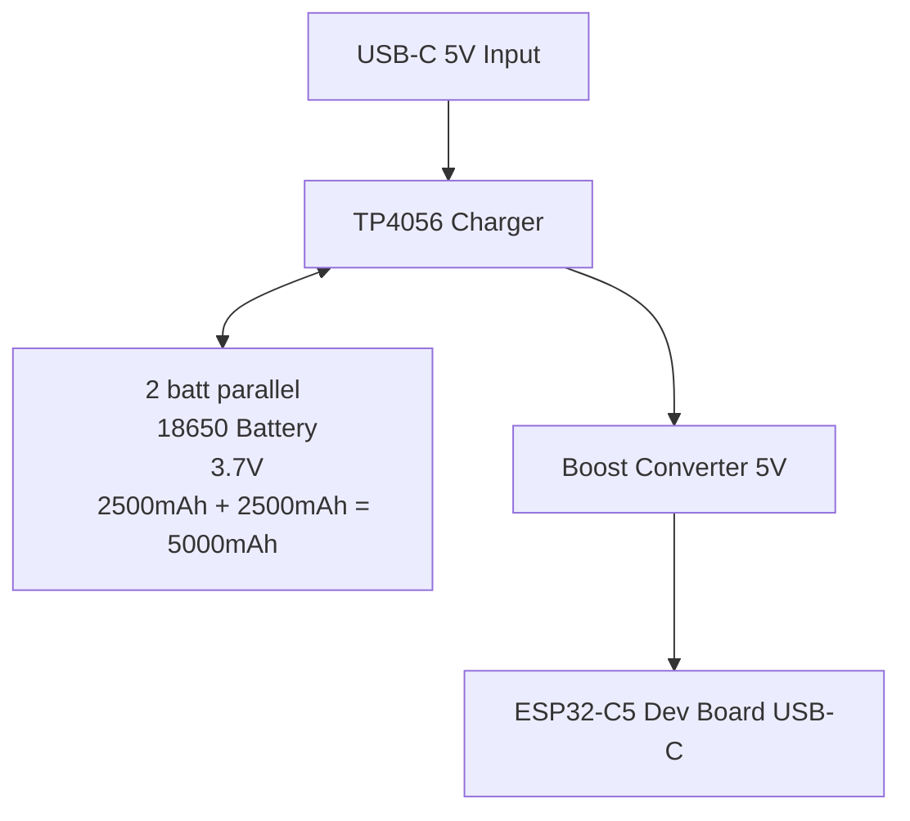

# Power Delivery

[TP4056 batt charger](https://opencircuit.be/product/tp4056-lipo-batterij-oplader-bescherming-1a)
[BOOST converter](https://opencircuit.be/product/boost-converter-module-5v-35v-xl6009)
[adafruit lithium 3.7V 6600mAh](https://opencircuit.be/product/lithium-ion-battery-pack-3.7v-6600mah)
[ESP32-C5 Dev Board USB-C mouser 4 weken lead time](https://www.mouser.be/ProductDetail/Espressif-Systems/ESP32-C5-DevKitC-1-N8R8?qs=6avfeC6zeS67aD1hu9NHBw%3D%3D)
[ESP32-C5 Dev Board USB-C digi-key 19 weken?? lead time](https://www.digikey.be/en/products/detail/espressif-systems/ESP32-C5-DEVKITC-1-N8R8/28718162?s=N4IgTCBcDaIKIGUAKBmMBaAwgVnQEQFMA3AaQEsAXTdARnQDkAOAJUZAF0BfIA)
[batt houder 18650](https://opencircuit.be/product/battery-holder-1x18650-wire-leads)