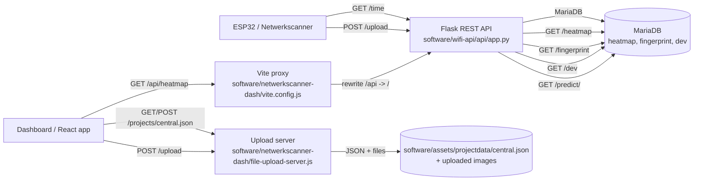

# REST API overzicht

## Kort

- De hoofd-REST-API is de Flask-service in `software/wifi-api/api/app.py`.
- De dashboard gebruikt Vite als proxy voor `/api/*`.
- Gebouw- en vloerdata worden opgeslagen via de uploadserver in JSON en uploads in `software/assets/projectdata`.
- Scan- en fingerprintdata gaan naar MariaDB.